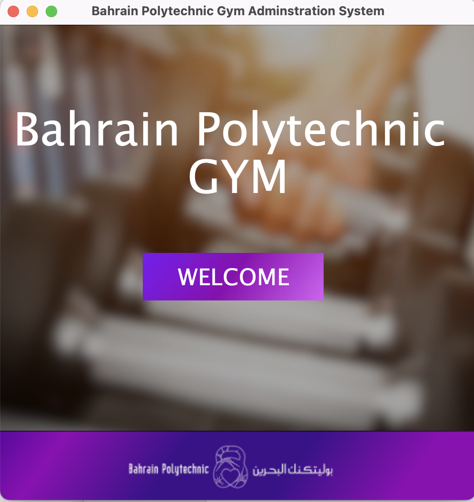
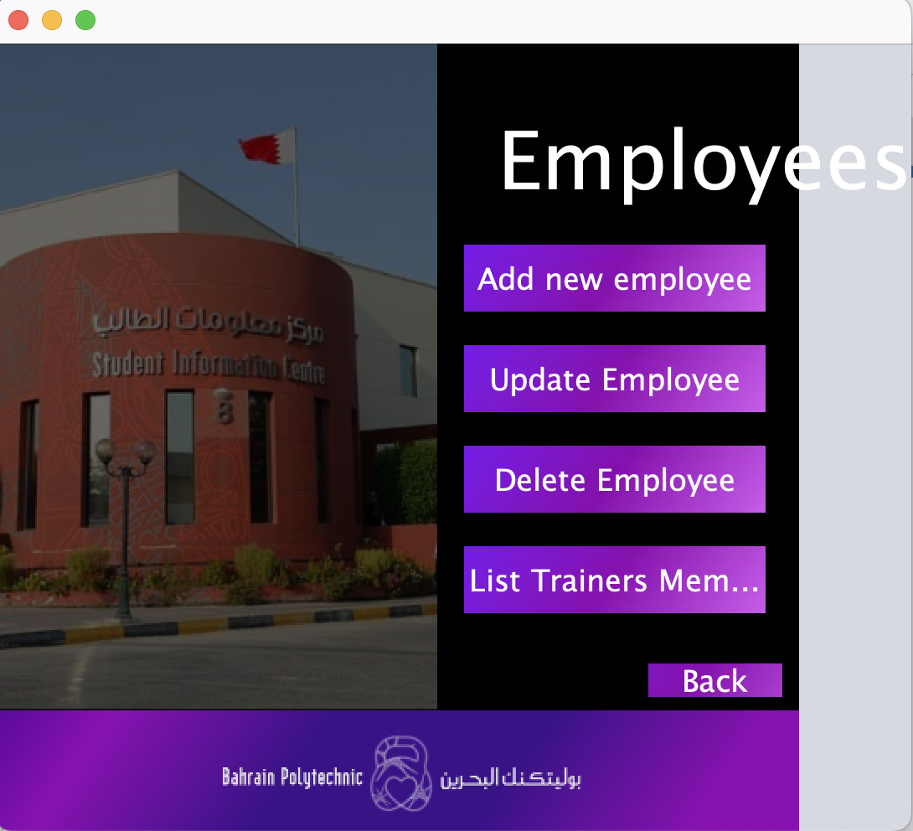
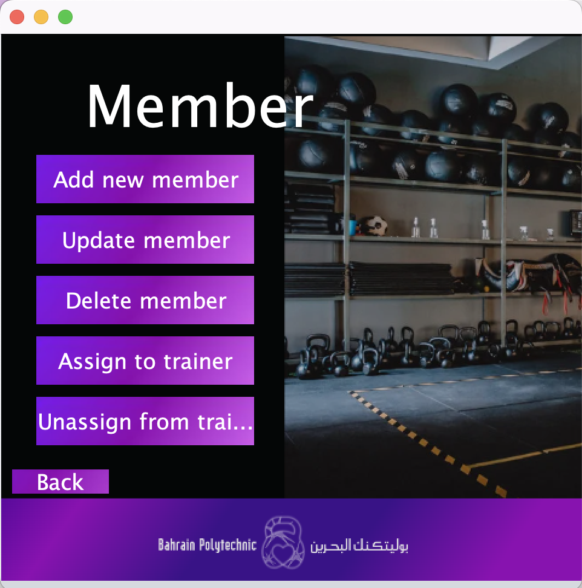
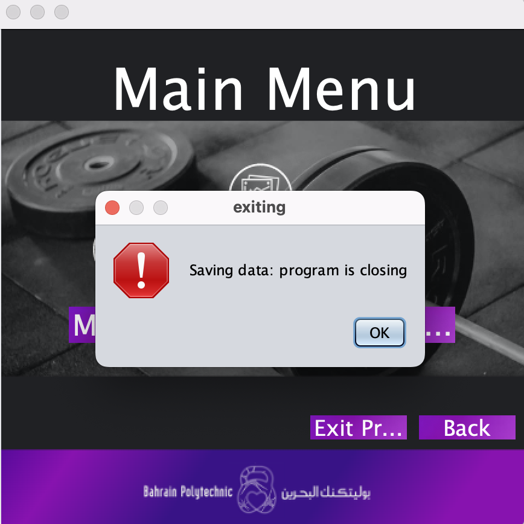

# Gym Management System

A Java-based gym management system with a user-friendly graphical interface for efficiently managing gym employees, members, and related tasks.

## Key Features

- **Graphical User Interface (GUI):** Professional and intuitive design
- **Adding Employees and Members:** Easily add new gym employees and members through a validated input process.
- **Updating Details:** Alter and update details for both gym members and employees.
- **Assigning and Removing Members from Personal Trainers:** Assign or remove members from personal trainers with user-friendly interfaces.
- **Deleting Employees and Members:** Secure deletion mechanisms with proper checks to prevent unintended deletions.
- **Listing Assigned Members:** View a list of gym members assigned to a specific personal trainer.
- **Generating Marketing Report:** Create a 'MarketingReport.txt' file with information about staff and students.
- **Data Persistence:** Save and retrieve data between program runs for a seamless user experience.
- **Initialization with Pre-determined Data:** Initialize the system with predefined data for a new installation.
- **Graceful Program Exit:** Terminate the program gracefully using GUI-provided exit options.
- **Exception Handling:** Anticipate and handle possible exceptions with user-friendly messages.
- **Separation of Logic and GUI:** Maintain clear separation of classes into Logic and GUI packages.

## Screenshots
#### Main Page

#### Employee's Main Page 

#### Member's Main Page

#### Exiting The Program

