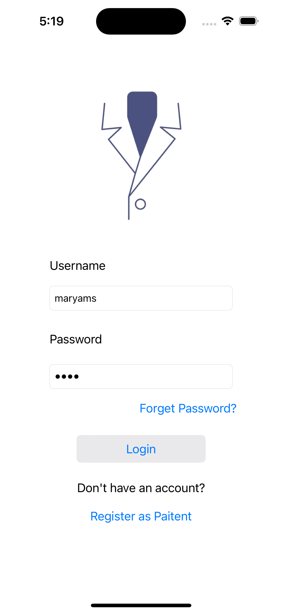
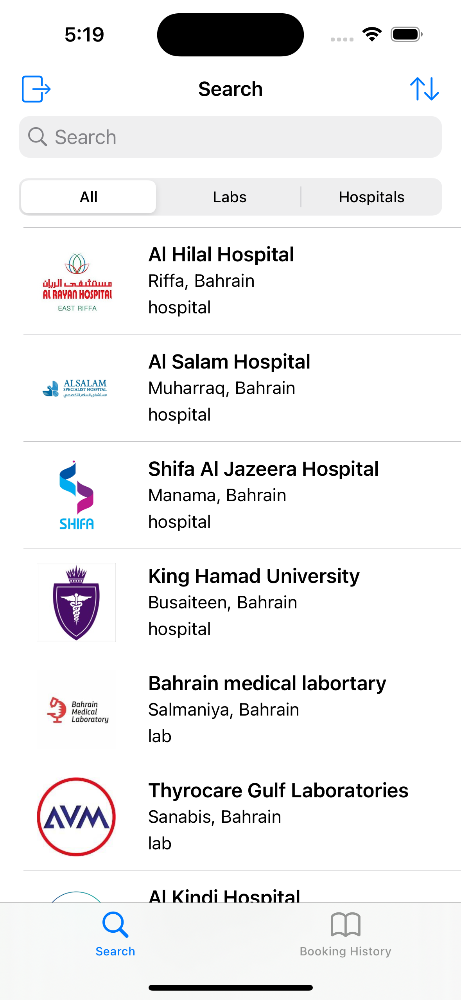
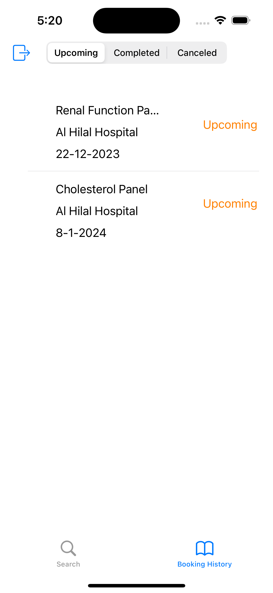
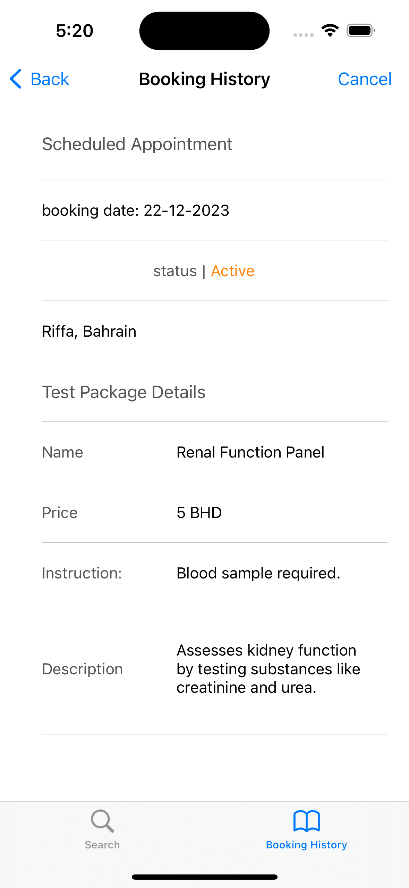

# LabCaught - Medical Lab Finder iOS App

LabCaught is an iOS app designed to help users find medical labs (or hospitals) in Bahrain for running referred tests. This app caters to three main user types: Admin, Lab, and Patient.

## Features
### Main Page

### All users 
- **Log in**
  
#### Admin Access
- **Add/Edit labs (or hospitals)**
- **View/Delete labs (or hospitals)**

#### Lab Access
- **Add/Edit medical packages**
- **View/Delete medical packages**
- **View/Complete/Cancel bookings**

#### Patient Access
- **Register**
- **Book/Cancel test or package** 
- **Booking history**
- **View labs / tests** (including Search, Sort, Filter)
- **Home/Explore Screen** 

## Log In Credentials

---------------------------------------------
| User Type | Username           | Password |
|-----------|--------------------|----------|
| Patient   | sa56               | 7655     |
| Hospital  | Alhilal            | 12345    |
| Lab       | BlossomMedical     | 12345    |
---------------------------------------------

## Screenshots
###### Log In Page

###### Home Page

###### Booking History Page

###### Booking Details Page

