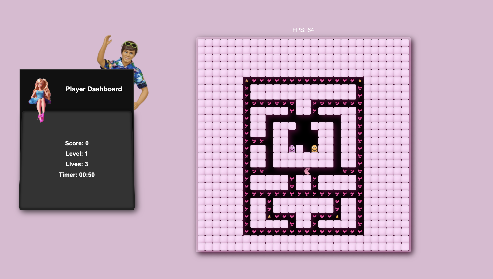

# Pac-Man Game

A classic single-player Pac-Man game recreated using JavaScript, HTML, and CSS.

## 👾 Game Visuals

## 🕹️ Gameplay

Navigate Pac-Man through the maze, eating all the pac-dots while avoiding ghosts. Consume power pellets to turn the tables on the ghosts and eat them for bonus points!

### 🎮 Controls

- **Arrow Keys**: Move Pac-Man up, down, left, or right
- **P Key**: Open/close the pause menu
  - Resume: Continue the game
  - Restart: Start a new game

### 🏆 Objectives

1. Eat all pac-dots before the timer runs out
2. Avoid ghosts or lose a life (unless powered up)
3. Consume power pellets to eat ghosts and gain bonus points
4. Complete the level before the timer expires

### ❤️ Lives

- Start with 3 lives
- Lose a life when touched by a ghost (without power-up)
- Game over when all lives are lost

### 🪙 Points System
- Pac-dots -- 1 point
- Power-pellets -- 10 points
- Ghost-Eaten -- 100 points

## 🌟 Features

- Classic Pac-Man gameplay
- Responsive controls
- Power-up mechanics
- Timer-based challenges
- Pause functionality
- Life system

## 🚀 Getting Started

1. Clone this repository
2. Open `index.html` in your web browser
3. Use arrow keys to control Pac-Man and start playing!

## 🛠️ Built With

- HTML5
- CSS3
- JavaScript

## 👥 Contributors

- Maryam Salah (msalah)
- Fatema Naser (fnaser)
