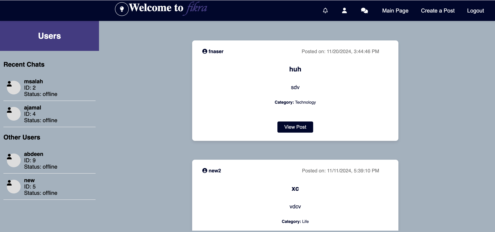
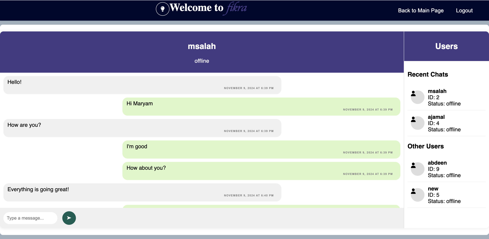

# Fikra 🗨️

Fikra is a dynamic forum platform designed to enhance community interaction and engagement. Users can register, post content, comment, and exchange real-time messages, all within an intuitive interface.

## 🌟 Features

- **🔑 User Registration and Authentication**: Securely create and manage your account.
- **✍️ Post Creation and Management**: Share your thoughts, view all posts, and like or dislike content.
- **💬 Commenting System**: Engage with posts through comments and reactions.
- **💌 Real-Time Messaging**: Chat with other users instantly through a seamless interface.
- **👤 Profile**: Users can view their profile details.

## 🛠️ Technologies Used

- **Go (Golang)**: For efficient and scalable backend functionality.
- **JavaScript**: Adds interactivity and responsiveness.
- **HTML5 & CSS3**: Provides structure and styles for an elegant user interface.
- **SQLite**: Reliable, lightweight database solution.

## 📸 Project Visuals


*The main page showcasing recent posts and interactive features.*


*Real-time messaging interface for seamless communication.*

## 🚀 Getting Started

1. **Clone the Repository** 

2. **Navigate to the Directory**
   
3. **Run the Application**:  
   ```bash
   go run main.go
   ```
4. **Access the Platform**: Open your browser and navigate to `http://localhost:8080`.

## ✨ How to Use

- **Register** to create an account.
- **Log In** to start posting, commenting, and messaging.
- Explore posts, interact with comments, and connect with others in real time!

## 👥 Project By

- [fnaser4](https://github.com/fnaser4)
- [msalah](https://github.com/marymSalah)
